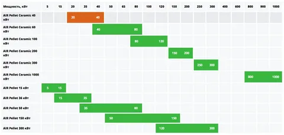

= Проект по разработке системы внедрения новых продуктов в сети столовых "Замысловатость"

== Общая информация
Необходимо заполнить данный раздел 

== Цели внедрения проекта
Необходимо заполнить данный раздел

//Пример нумерованного списка:

. цель 1
. цель 2

== Описание проекта
В этом разделе необходимо описать:

//Пример маркированного списка
* ключевые задачи проекта, 
* указать ИТ-методолгию для разработки и внедрения, привести обоснование выбора данной методологии
* как и в какой системе будет осуществляться управление проектом
* привести ссылку на проект

//формат для вставки гиперссылки link

== Roadmap проекта

https://github.com/tkupriyanova/docs-as-code-homework[ссылка на репозиторий]

Контракт:
link:yaml/OpenApi_Sunset.yaml[спецификация]

== Команда проекта

.Команда проекта
[cols="2*",options="header"]  
|=== 
|Должность|Количество
|Team Lead системных аналитиков|1
|Системный аналитик|1
|BE Разработчик|1
|FE Разработчик|1
|Тестировщик|1
|===

== Риски проекта

В данном разделе привести анализ и план-структуру возможных рисков.

== Описание выбранного решения

Необходимо заполнить данный раздел

== Описание архитектуры с НФТ

Вставить изображение архитектуры с пояснениями.

В связи с решением о применении в организации ISO/IEC 27001 для безопасности данных было принято решение реализовать применение НФТ в сервисе с наиболее чувствительными данными - сервисе "Система управления заказами"

.Нефункциональные требования
[options="header"]
|===
|Требование |Атрибут 
|Доступность	| 
|Минимальное время простоя	| 
|Быстрый доступ к системе	| 
|Быстродействие	|  
|Отзывчивость системы	| 
|Минимальное время ответа на запрос	|   
|Количество ошибок	|  
|Время восстановления после отказа системы	| 
|Защита от сбоев	|  
|Добавление новых точек входа для создания заказов	|  
|Горизонтальное масштабирование (увеличение мощности при увеличении количества заказов)	|  
|Противостояние несанкционированному доступу	|  
|Целостность данных	|  
|===

== Заключение

Реализация этого проекта позволит ...